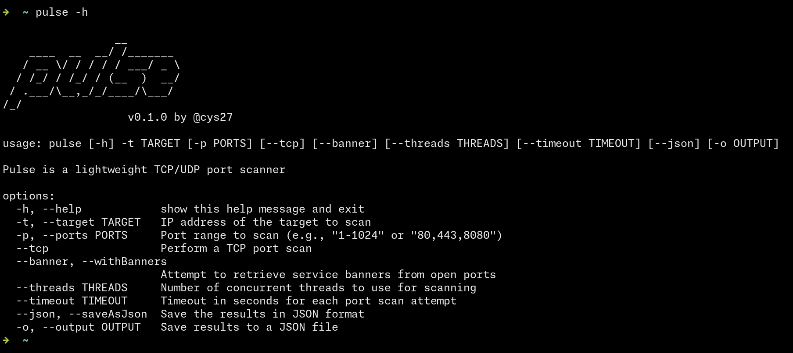

# Pulse

Pulse is a lightweight, multi-threaded TCP port scanner written in Python. It is designed to be fast, simple to use, and effective for network reconnaissance tasks.



## Features

- **TCP Port Scanning**: Quickly scan for open TCP ports on a target system.
- **Banner Grabbing**: Retrieve service banners from open ports to identify running services. Includes support for HTTP/HTTPS headers and generic service banners.
- **Multi-threading**: Utilizes threading to scan multiple ports concurrently, significantly speeding up the scanning process.
- **JSON Output**: Option to save scan results to a JSON file for easy parsing, reporting, or integration with other tools.
- **Customizable**: Flexible configuration for port ranges, connection timeouts, and thread counts.

## Installation

### Prerequisites

- Python 3.x

### Setup

1. Clone the repository:
   ```bash
   git clone https://github.com/cys27/pulse.git
   cd pulse
   ```

2. Run the setup script to install dependencies and create a global command:
   ```bash
   chmod +x install.sh
   ./install.sh
   ```
   
   This script will:
   - Check for Python 3.
   - Make the script executable.
   - Create a symbolic link so you can run `pulse` from anywhere.

### Uninstall

To remove the global `pulse` command from your system:
```bash
chmod +x uninstall.sh
./uninstall.sh
```

## Usage

```bash
pulse --help
```

### Arguments

| Argument    | Short | Description                                               | Default      |
| ----------- | ----- | --------------------------------------------------------- | ------------ |
| `--target`  | `-t`  | Target IP address or hostname to scan.                    | **Required** |
| `--tcp`     |       | Perform a TCP port scan.                                  | **Required** |
| `--ports`   | `-p`  | Port range to scan (e.g., `1-1024`, `80,443`, `1-65535`). | `1-1024`     |
| `--banner`  |       | Attempt to grab banners from open ports.                  | `False`      |
| `--threads` |       | Number of concurrent threads to use.                      | `10`         |
| `--timeout` |       | Timeout in seconds for socket connections.                | `1.0`        |
| `--json`    |       | Save the results in JSON format (auto-generated name).    | `False`      |
| `--output`  | `-o`  | Specify a custom filename for JSON output.                | `None`       |

## Examples

**Basic Scan (Default ports 1-1024):**
```bash
pulse -t 192.168.1.1 --tcp
```

**Scan Specific Ports with Banner Grabbing:**
```bash
pulse -t google.com -p 80,443,8080 --tcp --banner
```

**Fast Scan (High Threads, Low Timeout):**
```bash
pulse -t 10.0.0.5 -p 1-65535 --tcp --threads 100 --timeout 0.5
```

**Save Results to JSON:**
```bash
pulse -t example.com --tcp --json -o results.json
```

## Limitations & Roadmap

- **UDP Scanning**: Currently, Pulse **only supports TCP scanning**. UDP scanning support is not yet implemented but is planned for future releases.
- **Service Detection**: Service names are currently identified using a **static mapping** (based on standard port numbers defined in `data/services.json`). Future versions will aim to implement dynamic service detection based on protocol signatures and banner analysis.

## License

This project is licensed under the GNU General Public License v3.0 (GPLv3). See the [LICENSE](LICENSE) file for details.
